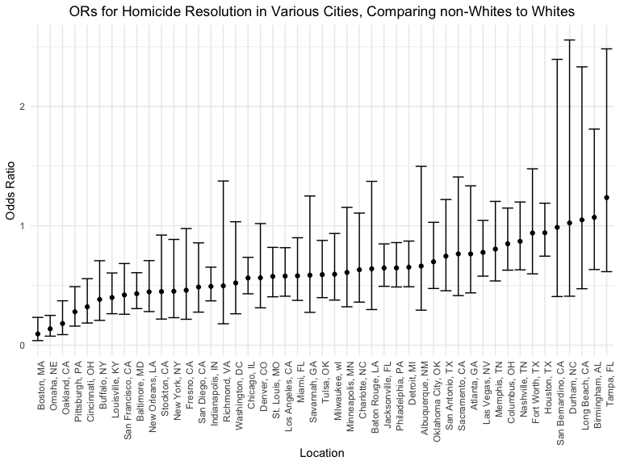
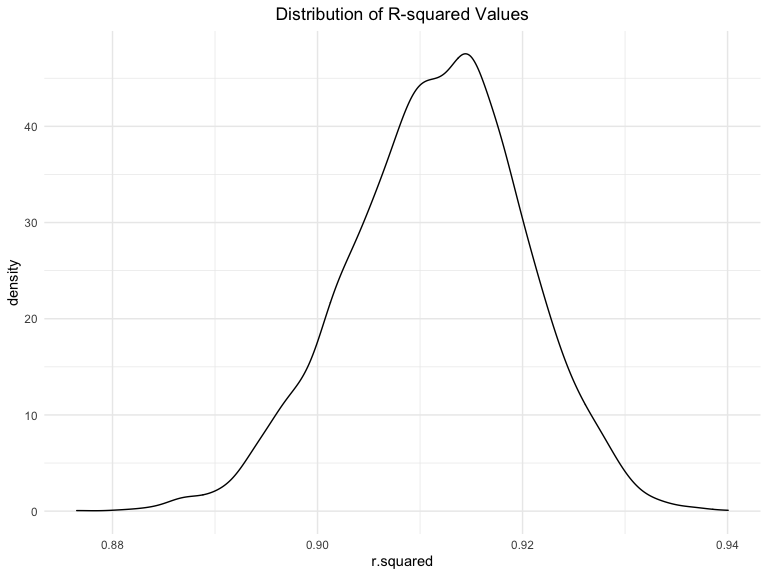

Homework 6
================
Yaa Ababio

### Problem 1

##### After reading in the data, create a `city_state` variable and binary variable indicating whether homicide is solved. Omit the following: Dallas,TX; Phoenix,AZ; Kansas City, MO; Tulsa, AL. Limit analysis to `victim_race` is `white` or `black` and only retain relevant variables.

``` r
homicide_df = 
  read_csv("./homicide_data /homicide-data.csv", na = c("", "NA", "Unknown")) %>% 
  mutate(
    city_state = str_c(city, state, sep = ", "),
    victim_age = as.numeric(victim_age),
    resolution = case_when(
      disposition == "Closed without arrest" ~ 0,
      disposition == "Open/No arrest"        ~ 0,
      disposition == "Closed by arrest"      ~ 1)
  ) %>% 
  filter(
    victim_race %in% c("White", "Black"),
    #removing unneccessary cities
    !city_state %in% c("Dallas, TX", "Phoenix, AZ", "Kansas City, MO", "Tulsa, AL"))    %>% 
  #ensuring that White is the reference group
  mutate(victim_race = fct_relevel(victim_race, "White", "Black")) %>%
  select(city_state, resolution, victim_age, victim_race, victim_sex)
```

 

##### Use the `glm` function to fit a logistic regression for Baltimore, MD with resolved vs unresolved as the outcome and victim age, sex and race as predictors. Obtain the estimate and confidence interval of the adjusted odds ratio for solving homicides comparing non-white victims to white victims keeping all other variables fixed.

``` r
baltimore_df =
  homicide_df %>% 
  filter(city_state == "Baltimore, MD")

glm(resolution ~ victim_age + victim_race + victim_sex, 
    data = baltimore_df,
    family = binomial()) %>% 
  broom::tidy() %>% 
  mutate(
    OR = exp(estimate),
    CI_lower = exp(estimate - 1.96 * std.error),
    CI_upper = exp(estimate + 1.96 * std.error)
  ) %>% 
  select(term, OR, starts_with("CI")) %>% 
  knitr::kable(digits = 3)
```

| term              |    OR | CI\_lower | CI\_upper |
| :---------------- | ----: | --------: | --------: |
| (Intercept)       | 3.164 |     1.989 |     5.031 |
| victim\_age       | 0.993 |     0.987 |     1.000 |
| victim\_raceBlack | 0.431 |     0.306 |     0.607 |
| victim\_sexMale   | 0.426 |     0.325 |     0.558 |

In Baltimore, the odds of solving a non-White (Black) homicide victim’s
case is 0.431 times the odds of solving a White victim’s homicide case
(95% CI:0.306, 0.607).

 

##### Run `glm` for each of the cities in your dataset, and extract the adjusted odds ratio (and CI) for solving homicides comparing Black victims to white victims.

``` r
models_results_df = 
  homicide_df %>% 
  nest(data = -city_state) %>% 
  mutate(
    models = 
      map(.x = data, ~glm(resolution ~ victim_age + victim_race + victim_sex, data = .x, family = binomial())),
    results = map(models, broom::tidy)
  ) %>% 
  select(city_state, results) %>% 
  unnest(results) %>% 
  mutate(
    OR = exp(estimate),
    CI_lower = exp(estimate - 1.96 * std.error),
    CI_upper = exp(estimate + 1.96 * std.error)
  ) %>% 
  filter(term == "victim_raceBlack") %>%
  select(city_state, term, OR, starts_with("CI")) 
```

 

##### Create a plot that shows the estimated ORs and CIs for each city and be sure to organize cities by estimated OR.

``` r
models_results_df %>% 
  mutate(city_state = fct_reorder(city_state, OR)) %>% 
  ggplot(aes(x = city_state, y = OR)) + 
  geom_point() + 
  geom_errorbar(aes(ymin = CI_lower, ymax = CI_upper)) + 
  labs(
    title = "ORs for Homicide Resolution in Various Cities, Comparing non-Whites to Whites",
    y = "Odds Ratio",
    x = "Location"
  ) +
    theme(plot.title = element_text(hjust = 0.5),                                              axis.text.x = element_text(angle = 90, hjust = 1))
```



From the plot above, we observe that Tampa, Birmingham, Long Beach, and
Durham reported the highest odds ratio estimates (all exceeding the null
value of 1). In these cities, homicides involving non-Whites were more
likely to be resolved than homicides involving Whites. However, it is
important to note that the confidence intervals for the odds ratios
above contain the null value of 1, meaning that these results are NOT
statistically significant.

Conversely, Boston, Omaha, and Oakland report the lowest odds ratio
estimates (all below the null value of 1). In these cities, homicides
involving non-Whites were less likely to be resolved than homicides
involving Whites. These results are statistically significant, as the
confidence intervals for the ORs in the above-mentioned cities do NOT
contain the null value of 1.

 

 

### Problem 2

##### Load and clean birthweight data for regression analysis (i.e. convert numeric to factor where appropriate, check for missing data, etc.).

``` r
birth_df = 
  read_csv("./birth_data/birthweight.csv")

anyNA(birth_df)
```

    ## [1] FALSE

``` r
birth_df = birth_df %>%
  mutate(
    babysex = factor(babysex, levels = c(1, 2), labels = c("male", "female")),
    frace = factor(frace, levels = c(1, 2, 3, 4, 8, 9),
                      labels = c("white", "black", "asian", "puerto rican", "other",                                  "unknown")),
    mrace = factor(mrace, levels = c(1, 2, 3, 4, 8, 9),                                                    labels = c("white","black", "asian", "puerto rican", "other",                                   "unknown")), 
    malform = factor(malform, levels = c(0, 1), labels = c("absent", "present"))
  ) 
```

After loading the data, there did not appear to be any missing data.
Categorical variables (babysex, frace, malform, and mrace) were
converted from numeric to factor variables. Additionally, appropriate
labels were added to the aforementioned variables.

 

##### Propose a regression model for birthweight.

The literature suggests that socioeconomic predictors may be associated
with low birthweight in babies. I hypothesize that number of cigarettes
smoked per day, mother’s race, family income will be significantly
associated with birthweight.

 

 

### Problem 3

##### Download 2017 Central Park Weather dataset.

``` r
weather_df = 
  rnoaa::meteo_pull_monitors(
    c("USW00094728"),
    var = c("PRCP", "TMIN", "TMAX"), 
    date_min = "2017-01-01",
    date_max = "2017-12-31") %>%
  mutate(
    name = recode(id, USW00094728 = "CentralPark_NY"),
    tmin = tmin / 10,
    tmax = tmax / 10) %>%
  select(name, id, everything())
```

    ## Registered S3 method overwritten by 'hoardr':
    ##   method           from
    ##   print.cache_info httr

    ## using cached file: /Users/yababio/Library/Caches/R/noaa_ghcnd/USW00094728.dly

    ## date created (size, mb): 2020-12-09 15:46:34 (7.536)

    ## file min/max dates: 1869-01-01 / 2020-12-31

 

###### Use 5000 bootstrap samples and, for each bootstrap sample, produce estimates R-squared and log(β̂ 0∗β̂ 1)

``` r
#writing function
boot_sample = function(df) {
  sample_frac(df, replace = TRUE)
}

#generating 5000 samples    
boot_straps = 
  tibble(
    strap_number = 1:5000,
    strap_sample = rerun(5000, boot_sample(weather_df))
  )
```

``` r
#Producing R-squared estimates

results_rsq = boot_straps %>%
  mutate(
    models = map(strap_sample, ~lm(tmax ~ tmin, data = .x)),
    results = map(models, broom::glance)
        ) %>%
  select(-models, -strap_sample) %>%
  unnest(cols = c(results))


summarize(
  results_rsq,
  mean = mean(r.squared),
  std_error = sd(r.squared)
  ) %>%
  knitr::kable()
```

|     mean | std\_error |
| -------: | ---------: |
| 0.911569 |  0.0085157 |

 

###### 1\) R-squared Plot

``` r
results_rsq %>%
  ggplot(aes(x = r.squared)) +
  geom_density() +
  labs( title = "Distribution of R-squared Values") +
  theme(plot.title = element_text(hjust = 0.5))
```


